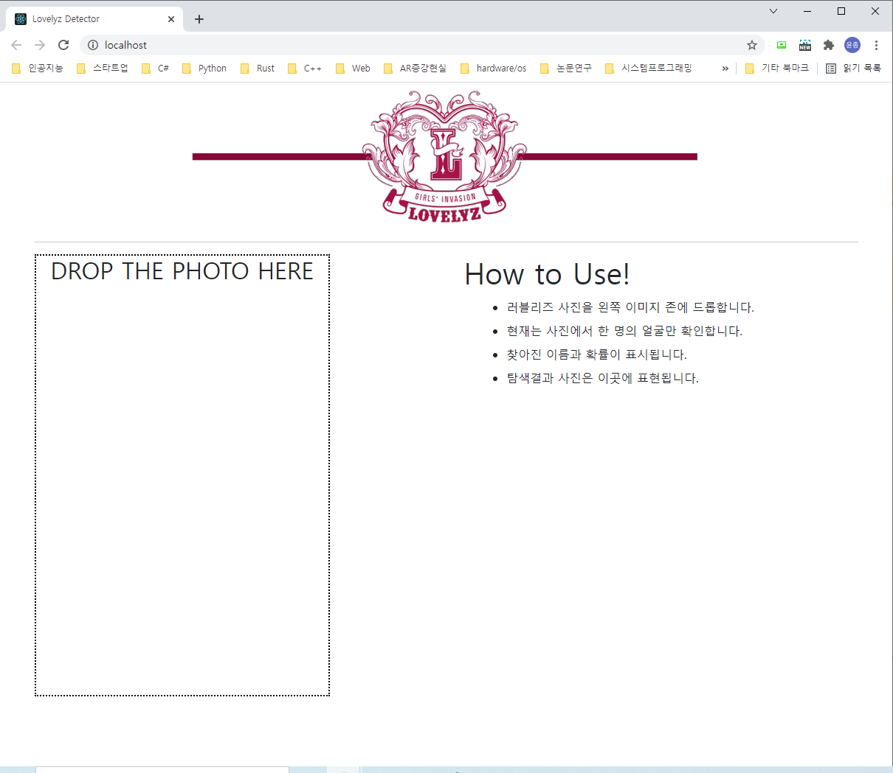
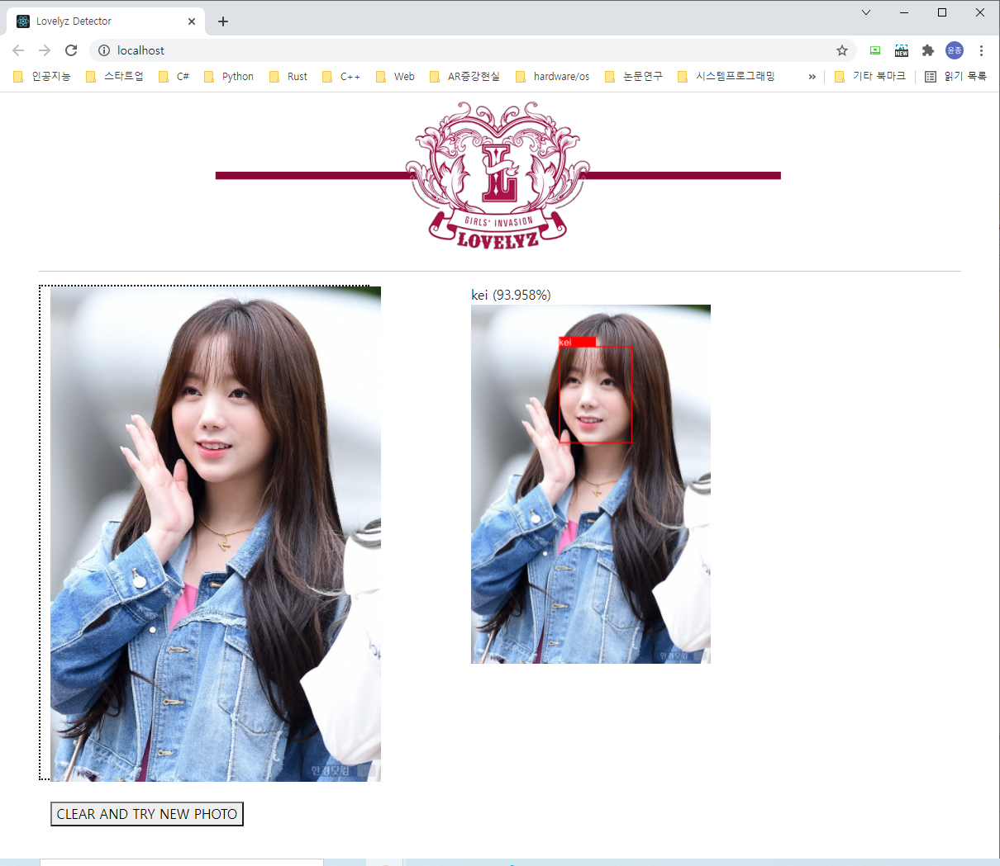

# LovelyzDetector API Project

## 개요

간단한 러블리즈 얼굴 인식 웹 애플리케이션

- MTCNN을 통한 얼굴 부위 탐색
- FaceNet을 사용해 탐색된 얼굴 영역을 embedding vector로 변환
- 임베딩벡터를 사람별로 분류하는 SVM 학습
- 이상의 동작을 API로 제공하기 위한 Flask 활용
- React.js로 구성한 웹 애플리케이션

## 실행 방법

1. Flask api 실행

   ```shell
   $ cd src
   $ python api_keras.py
   ```

2. 웹 서버 실행 

   ``` shell
   $ cd lovelyzdetector
   $ yarn start
   ```


단, 실행 및 학습을 위해서 몇가지 필요한 사항이 있다.

- 크롤링 코드를 사용하면 러블리즈 멤버별 이미지가 crawl/lovelyz 폴더에 저장된다. 그러나 단독으로 촬영된 이미지를 사용하고 학습이 어려운 이미지를 제거한 뒤, training / validation set으로 분할하는 과정이 필요하다. 이 과정은 수동으로 진행하였고, data 폴더 안에 저장되어 있다.
- face recognition을 위한 classifier로 FaceNet 모델 자체를 이용하는 경우, inference 속도가 상대적으로 느린 점을 고려한다. 따라서 pre-trained FaceNet 모델을 사용하여 주어진 이미지를 임베딩 벡터로 변환한 뒤, 임베딩 벡터들을 분류하는 SVM classifier를 학습시켰다. pre-trained model은 [keras-facenet](https://github.com/nyoki-mtl/keras-facenet)에서 받을 수 있고, src 폴더에 저장한다.
- src/train_keras.py 를 통해 학습을 시키면, api가 사용하는 svm 모델학습파일과 레이블 정보가 담긴 파일이 생성된다.

## 실행 결과

##  

## 참고

- [How to Develop a Face Recognition System Using FaceNet in Keras](https://machinelearningmastery.com/how-to-develop-a-face-recognition-system-using-facenet-in-keras-and-an-svm-classifier/)
- [nyoki-mtl/keras-facenet](https://github.com/nyoki-mtl/keras-facenet)
- [Finetune a Facial Recognition Classifier to Recognize your Face using PyTorch](https://towardsdatascience.com/finetune-a-facial-recognition-classifier-to-recognize-your-face-using-pytorch-d00a639d9a79)

## Future work

- pytorch로 FaceNet을 직접 구현하고, classifier로 직접 사용하였을 경우 성능 및 inference speed를 비교해본다.